## What we're building

A **data-driven replay system**: every milestone of an incident captures a full snapshot of where every agent/patient/bed/equipment was (with a real timestamp), exported to `out/replay/{incident}.json` — the same file-boundary pattern the existing brief uses. A replay page reuses the _existing dashboard SVG floor map_ and plays the incident back with real-time token motion. The milestone keyframes are rasterized to PNGs and handed to Pika `generate_keyframes_video`, which interpolates smooth motion between the real states. Pika stops being a hallucinated animation and becomes a reconstruction of ground-truth state.

This extends the existing `incident-replay` arrow (currently OK → moves to PARTIAL until implemented). Pika stays **outside** the uAgents runtime — the boundary is still files in `out/`.

## Decisions locked from your answers (+ robustness corrections)

- **Render source**: reuse the dashboard's existing SVG floor map (not Pillow). Frames are captured from a replay playback page, so they look exactly like the live dashboard.
- **History capture**: full-state snapshot per milestone, exported to **`out/replay/{incident}.json`** (not `er:replay:*` Redis keys). _Correction: the dashboard runs in a separate process from the orchestrator; `InMemoryStore` is process-local, so a Redis-key timeline would be invisible to the replay page and would silently depend on the unfinished `DASH-SYS-002`. The out/ file mirrors the existing brief export and keeps this arrow independent._
- **Real time**: each snapshot carries a real wall-clock `ts`; playback paces motion by `ts` deltas. _Correction: `ts` lives on the snapshot records only — the `er:events` milestone line stays wall-clock-free, so `REPLAY-LOG-002` and its tests (`test_replay.py:36,39`) are untouched._
- **Scope**: all three events (intake, oxygen, summary).
- **Assembly**: render keyframes → Pika `generate_keyframes_video` interpolates; keep the existing external Claude-CLI trigger.
- **Modeling assumption**: entities have discrete locations (zones/beds), not continuous coordinates. Playback linearly tweens a token from zone A→B over the `ts` interval — an approximation, stated in the LLD so we don't overclaim exact positions.

### Incident-library decisions (your answers)

- **Time compression**: the replay clip compresses real elapsed time by a configurable `speed_factor` (default **10x** — 10 real seconds ≈ 1 video second). Applied in the timeline→keyframe mapping (requested clip duration ≈ `real_elapsed / speed_factor`, clamped to Pika's min/max), so the clip is short and frame-space isn't wasted.
- **Video persistence**: **URL-only** — the library stores the Pika-hosted `video_url` per incident (no local mp4 download). _Tradeoff accepted: entries won't play offline or after the asset expires; each entry also links to the in-browser `/replay/{incident}` fallback._
- **Library scope**: **session-only** — the `/library` page lists whatever incidents currently exist in `out/replay/` (no cross-run index, no date grouping). Reuses the dashboard auth gate.
- **Per-entry metadata** (all derivable, no new capture): description (`title` + `summary`), event type (`incident_type`), start/end times (first/last snapshot `ts`), and those involved (distinct `actor` + `target` from the timeline, mapped through `DISPLAY_NAMES`).

## Data flow

```mermaid
flowchart LR
    Orch["Orchestrator milestone"] -->|"snapshot (ts) accumulated in-process"| Export["export_incident()"]
    Export --> File[("out/replay/{incident}.json")]
    File -->|served as static/out file| Page["replay.html (reuses dashboard SVG, real-time playback)"]
    Page -->|Playwright screenshot per keyframe| Frames["out/frames/{incident}/*.png"]
    Frames -->|generate_keyframes_video| Pika["Pika MCP"]
    Pika --> Clip["out/pika_result.json + replay clip URL"]
```

## Intent cascade first (intent-driven-dev)

Before code, update the chain so it stays coherent:

1. **LLD** — extend [docs/llds/er-twin-core.lld.md](docs/llds/er-twin-core.lld.md) §9: add the snapshot-timeline contract (`out/replay/{incident}.json` schema with per-snapshot `ts`, plus the library metadata fields and `video_url`), the replay-page/playback contract (incl. the discrete-location tween assumption), the keyframe→Pika invocation with `speed_factor`, and the library page. Boundary stays file-based; `REPLAY-LOG-002` is unchanged.
2. **EARS** — in [docs/specs/er-events-specs.md](docs/specs/er-events-specs.md): add a `REPLAY-SNAP / FRAME / KEY / PIKA / LIB` block (see below). No change to `REPLAY-LOG-002`.
3. **Arrow** — flip [docs/arrows/incident-replay.md](docs/arrows/incident-replay.md) + [docs/arrows/index.yaml](docs/arrows/index.yaml) to PARTIAL with `next:` pointing at the new specs. It stays independent (no new `blockedby` on the dashboard arrow).

## New EARS specs (names)

- `REPLAY-SNAP-001` — on each milestone, capture all entity records + a real `ts` into the in-process incident timeline.
- `REPLAY-SNAP-002` — re-capturing the same `seq` overwrites (idempotent), never duplicates.
- `REPLAY-SNAP-003` — on incident export, write the ordered snapshot timeline to `out/replay/{incident}.json`; if no milestones ran, write nothing (mirrors `REPLAY-BRIEF-003`).
- `REPLAY-FRAME-001` — replay page positions every entity using the dashboard floor layout.
- `REPLAY-FRAME-002` — playback advances between snapshots in proportion to real `ts` deltas, tweening token motion (discrete-location approximation).
- `REPLAY-KEY-001` — keyframe selection picks state-change snapshots, capped at Pika's verified keyframe limit, degrading to start/mid/end when over the cap.
- `REPLAY-KEY-002` — one PNG written per selected keyframe to `out/frames/{incident}/`.
- `REPLAY-PIKA-001` — external Pika step passes keyframe PNGs to `generate_keyframes_video` for one interpolated clip.
- `REPLAY-PIKA-002` — if frames are missing, fall back to the existing text-brief Pika path (no crash).
- `REPLAY-LIB-001` — incident export includes library metadata: `title`, `summary`, `incident_type`, `start_ts`, `end_ts`, and `involved[]` (distinct timeline actors+targets via `DISPLAY_NAMES`).
- `REPLAY-LIB-002` — the timeline→keyframe mapping compresses real elapsed time by a configurable `speed_factor` (default 10x) so the requested clip duration ≈ `real_elapsed / speed_factor`.
- `REPLAY-LIB-003` — after the Pika step returns a media URL, the incident record (`out/replay/{incident}.json`) is updated with `video_url`.
- `REPLAY-LIB-004` — the gated `/library` page lists every incident in `out/replay/` for the session with its metadata and embedded video (`video_url`).
- `REPLAY-LIB-005` — if an incident has no `video_url` (Pika not run or failed), its entry still renders with metadata and a link to the in-browser `/replay/{incident}` fallback (no crash).

## Implementation phases

### Phase 1 — Snapshot capture + export (pure Python, testable)

- Extend [er_twin/replay.py](er_twin/replay.py): add a `SnapshotTimeline` (or extend `ReplayRecorder`) with `snapshot(store, seq, ts)` that deep-copies every `er:{entity}:{id}` record into an in-process, seq-keyed timeline (overwrite on duplicate `seq` — `REPLAY-SNAP-002`). `ts` is captured here, on the snapshot only — `ReplayRecorder.log` lines are left exactly as-is.
- Extend `export_incident` to also write `out/replay/{incident}.json` (ordered snapshots + `ts`); write nothing when no milestones ran (`REPLAY-SNAP-003`).
- Wire the orchestrator's existing milestone logging ([er_twin/agents/orchestrator.py](er_twin/agents/orchestrator.py) `_emit_replay`) to also take a snapshot. No new agent messages, no new store methods, no cross-process state.
- Tests in [tests/test_replay.py](tests/test_replay.py): snapshot shape, idempotent overwrite, ordering, `ts` present, export writes the timeline file, empty-incident writes nothing. Add a guard test asserting the existing `er:events` line shape is **unchanged**. `@spec REPLAY-SNAP-001/002/003`.

### Phase 2 — Replay playback page (reuses dashboard SVG, independently demoable)

- Refactor the floor layout + token positioning out of [dashboard/static/app.js](dashboard/static/app.js) into a shared `dashboard/static/floor.js` (the `FLOOR_ZONES` / `BED_LAYOUT` / positioning fns) imported by both the dashboard and the replay page — no behavior change to the live dashboard.
- Add `dashboard/static/replay.html` + `dashboard/static/replay.js`: fetch the incident timeline JSON, play snapshots back over real `ts` time, tweening tokens with the existing CSS transition. Include a scrub/seek control.
- Source the timeline from the `out/replay/{incident}.json` file (no store read): add `GET /replay/{incident}` (page) and `GET /api/replay/{incident}` (reads the out/ JSON) in [dashboard/server.py](dashboard/server.py); no `datasource`/Redis dependency.
- Tests in [tests/test_dashboard.py](tests/test_dashboard.py): timeline endpoint returns ordered snapshots with `ts` from a fixture file; page served; missing-incident → 404. `@spec REPLAY-FRAME-001/002`.

### Phase 3 — Frame capture (Playwright)

- Add `scripts/capture_replay_frames.py`: launch headless Chromium, load `/replay/{incident}`, seek to each keyframe time, screenshot to `out/frames/{incident}/frame_NN.png`. Keyframe-selection (which snapshots are state-changes, capped + start/mid/end degrade) lives in a pure function in `er_twin/replay.py` so it is unit-testable without a browser.
- Add `playwright` as a dev dependency in [pyproject.toml](pyproject.toml); document `playwright install chromium`.
- Risk/fallback: if Playwright install is problematic on the day, swap the rasterizer for `resvg`/`cairosvg` on the same replay SVG markup — keyframe selection and the Pika step are unchanged. Tests cover keyframe selection only. `@spec REPLAY-KEY-001/002`.

### Phase 4 — Pika keyframes (external, file-boundary)

- **Verify first**: confirm how many keyframes `generate_keyframes_video` accepts (estimate_cost / a small probe) before finalizing the cap in `REPLAY-KEY-001`. Design selection to degrade to start/mid/end if the cap is small (likely 2–5).
- Add `scripts/run_pika_keyframes.ps1` (sibling to [scripts/run_pika_replay.ps1](scripts/run_pika_replay.ps1)): pass the `out/frames/{incident}/*.png` keyframes to `mcp__pika-mcp__generate_keyframes_video` via the Claude CLI with the requested compressed duration (`real_elapsed / speed_factor`), poll `task_status`, write `out/pika_result.json`, and **write the returned media URL back into `out/replay/{incident}.json` as `video_url`** (`REPLAY-LIB-003`). Reuse the existing allowlist (already includes `generate_keyframes_video`).
- Update [scripts/pika_replay_operator.md](scripts/pika_replay_operator.md) with the new frames-based runbook; keep the text-brief path as the documented fallback (`REPLAY-PIKA-002`).

### Phase 6 — Incident-library page (session-only)

- Extend the incident export in [er_twin/replay.py](er_twin/replay.py) to include the library metadata block in `out/replay/{incident}.json`: `title`, `summary`, `incident_type`, `start_ts`, `end_ts` (first/last snapshot `ts`), `involved[]` (distinct timeline actors+targets via `DISPLAY_NAMES`), and `speed_factor`. These are pure derivations from data already captured. `@spec REPLAY-LIB-001/002`.
- Add a gated `GET /library` route + `GET /api/library` (globs `out/replay/*.json`, returns the entries) in [dashboard/server.py](dashboard/server.py); reuse `require_api`/session gate. Add `dashboard/static/library.html` + `library.js`: a card list with the embedded `<video src=video_url>`, description, event type, start/end times, and the involved list. Each entry links to `/replay/{incident}` as the offline fallback (`REPLAY-LIB-004/005`).
- Tests in [tests/test_replay.py](tests/test_replay.py) (metadata derivation, speed_factor math) and [tests/test_dashboard.py](tests/test_dashboard.py) (`/api/library` lists fixture incidents; entry without `video_url` still renders with the fallback link; auth gate enforced). `@spec REPLAY-LIB-001/002/004/005`.

### Phase 7 — Demo wiring + docs

- Orchestrator chat confirmation on incident resolve: "Incident resolved — replay captured (`/replay/{incident}`)." (text only; no Pika call in-process).
- Update [README.md](README.md) replay section, [STATUS.md](STATUS.md), and [docs/TEAM.md](docs/TEAM.md) handoff. Re-audit the arrow back toward OK.

## Validation

- `uv run pytest tests/test_replay.py tests/test_dashboard.py` — snapshot + export + timeline + keyframe-selection green, **plus the guard test that `er:events` line shape is unchanged**.
- `uv run pytest` — full suite still green (confirms `REPLAY-LOG-002` and existing brief tests untouched).
- `uv run ruff check .`
- Manual: run an event → `out/replay/{incident}.json` exists → `uv run uvicorn dashboard.server:app` → open `/replay/{incident}` and watch real-time playback on the existing map.
- `python scripts/capture_replay_frames.py {incident}` → confirm PNGs in `out/frames/`.
- `pwsh scripts/run_pika_keyframes.ps1 {incident}` → replay clip URL in `out/pika_result.json` and `video_url` written into `out/replay/{incident}.json`.
- Manual: open `/library` → all session incidents listed with video, description, event type, start/end times, and involved; an incident with no `video_url` still shows metadata + a `/replay/{incident}` link.

## Demo path & fallback ladder

1. Best: Pika keyframe clip plays.
2. If Pika fails live: the in-browser `/replay/{incident}` page plays the same reconstruction on the real map.
3. If both fail: pre-generated clip + frames committed in `out/`.

## Definition of done

- Snapshots captured per milestone with real `ts`; all three events covered; timeline exported to `out/replay/{incident}.json`.
- Replay page reuses the dashboard SVG map and paces by real time; works with the default in-process demo (no cross-process Redis required).
- Keyframes rasterized and accepted by Pika `generate_keyframes_video`; clip time-compressed by `speed_factor` (default 10x).
- `/library` lists all session incidents with video (`video_url`), description, event type, start/end times, and those involved; entries without a video degrade to a metadata card + `/replay/{incident}` fallback link.
- Intent chain coherent: LLD §9, EARS (new `REPLAY-SNAP/FRAME/KEY/PIKA/LIB`), and the `incident-replay` arrow updated; `@spec` annotations in code and tests.
- **No regressions**: `REPLAY-LOG-002` and its tests untouched; `er:events` line shape unchanged; no new `StorageInterface` methods; `incident-replay` arrow stays independent of `DASH-SYS-002`.
- Pika never imported inside `er_twin/`.
