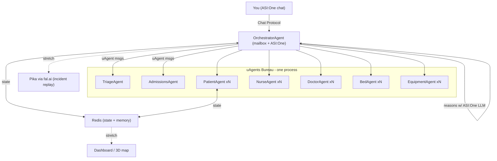

# ER Room Digital Twin

**Hackathon Technical Specification — Developer Reference**

Fetch.ai uAgents + Bureau · ASI:One · Redis · Pika via fal.ai (stretch)

> Target: 24-hour build · Python 3.11+ · Local Bureau, one Agentverse mailbox

---

## Feasibility Verdict

**✅ Feasible — with one critical architecture choice**

Running every entity as its own uAgent is realistic only if they run as **local agents inside a uAgents Bureau** (many agents, one process, one event loop, in-process messaging). Spinning up dozens of independently-hosted Agentverse agents — each registering on the Almanac via mailbox — would be slow and flaky to demo.

**Conclusion:** all entities are real uAgents inside a Bureau; only the `OrchestratorAgent` gets an Agentverse mailbox + Chat Protocol + ASI:One so you can talk to the system from outside.

**Demo priority:** Talking to the ASI:One orchestrator and watching it trigger ER events. Everything else is built in service of that one interaction loop.

---

## Overview

Emergency rooms operate in controlled chaos — every room, patient, nurse, doctor, and piece of equipment is a moving variable. This project builds an autonomous digital twin of a hospital emergency room where every physical entity is modeled as a uAgent, agents coordinate in real time via in-process Bureau messaging, and a single `OrchestratorAgent` — reachable through ASI:One — responds to critical events autonomously.

> This is not a dashboard that shows data. It is a system that **acts**.

---

## Getting Started

**Prerequisites:** Python 3.11+, [`uv`](https://docs.astral.sh/uv/) (`brew install uv`).

```bash
# 1. Clone and enter the repo
git clone https://github.com/RyanDang363/berk-ai-hackathon.git
cd berk-ai-hackathon

# 2. Set up environment variables
cp .env.example .env
# Edit .env — for a no-API-key local run, leave USE_MOCK=true

# 3. Install dependencies (creates a local .venv)
uv sync

# 4. Run the Bureau (mock mode — no ASI:One key needed)
USE_MOCK=true uv run python -m er_twin.main

# 5. Run the tests
uv run pytest
```

**Mock mode:** with `USE_MOCK=true` the Orchestrator returns hardcoded responses (see the
`USE_MOCK` contract in [docs/TEAM.md](docs/TEAM.md)), so you can build and test without an
`ASIONE_API_KEY`. Set `USE_MOCK=false` and add your key to use the real ASI:One LLM.

**Who builds what:** see [docs/TEAM.md](docs/TEAM.md) for the ownership map and git workflow, and
[STATUS.md](STATUS.md) for live progress.

---

## Core Problem

Emergency rooms suffer from cascading inefficiencies caused by static, reactive coordination:

- **Reactive triage** — staff only respond after bottlenecks form
- **No real-time resource awareness** — nurses waste time locating equipment
- **Manual bed assignment** — slow and error-prone under surge conditions
- **Critical event delays** — no autonomous escalation when a patient deteriorates
- **Siloed systems** — no single source of truth for room, staff, and equipment state

---

## Architecture

One `OrchestratorAgent` is publicly registered on Agentverse (mailbox + Chat Protocol) and is the only agent reachable from ASI:One. All other agents run in a local Bureau process and communicate in-process with zero network overhead. State is persisted in Redis.

### System Diagram



### Key Architecture Decisions

| Decision | Rationale |
| --- | --- |
| **Bureau for internal agents** | In-process messaging between all ER entity agents — no network hop, no Almanac registration overhead, persistent state across handler calls. Essential for demo reliability. |
| **Single Agentverse mailbox** | Only `OrchestratorAgent` registers on Agentverse + Chat Protocol. This is the sole public entry point. Maps to the HIPAA story: patient data never leaves the local process. |
| **ASI:One LLM reasoning** | `OrchestratorAgent` calls the ASI:One API to interpret natural language commands and decide which internal agents to message. Enables the judge-facing chat demo. |
| **Redis as state layer** | One hash per agent ID stores vitals, status, location, assignments. Pub/Sub feeds the stretch dashboard. Start with an in-memory dict behind a storage interface; swap to Redis once core works. |

---

## Technical Stack

| Component | Detail |
| --- | --- |
| **Language** | Python 3.11+ |
| **Agent framework** | `uagents` + `uagents-core` (Bureau for local agents; Chat Protocol for Orchestrator) |
| **Orchestrator brain** | ASI:One LLM via API — reasoning layer + the chat interface demoed to judges |
| **State / memory** | Redis — one hash per agent ID (vitals, status, location, assignments); Pub/Sub for dashboard feed |
| **Secrets** | `.env` + `.env.example` — keys: `ASIONE_API_KEY`, `REDIS_URL`, `FAL_KEY`. Never commit `.env`. |
| **Stretch — video** | Pika 2.2 image-to-video via fal.ai. Async (~minutes). Pre-generate one incident clip before judging. |
| **Stretch — dashboard** | FastAPI + static HTML reading Redis. 3D via Three.js only if time remains. |

---

## Agent Roster

> **Instance counts for demo** — Keep small: 3 PatientAgents, 2 NurseAgents, 2 DoctorAgents, 4 BedAgents, a handful of EquipmentAgents. This is a twin demo, not a load test.

### Core Agents (Build First)

| Agent | Responsibility |
| --- | --- |
| **OrchestratorAgent** | Mailbox + Chat Protocol + ASI:One. Public entry point. Receives NL commands, reasons with ASI:One LLM, dispatches uAgent messages to all Bureau agents. The only agent registered on Agentverse. |
| **TriageAgent** | Scores incoming patients by acuity level. Routes to appropriate bed and care team via Orchestrator. |
| **AdmissionsAgent** | Handles patient intake, collects initial data, passes structured record to TriageAgent. |
| **PatientAgent** | Tracks acuity level, vitals, current status, assigned bed, and care team. Emits state change events on deterioration. |
| **NurseAgent** | Tracks availability, current assignments, location, skill set. Accepts task dispatches from Orchestrator. |
| **DoctorAgent** | Tracks specialty, availability, current patient load. Responds to consult and emergency broadcasts. |
| **BedAgent** | Tracks occupancy, attached equipment, cleanliness status, specialty designation. Responds to assignment and release requests. |
| **EquipmentAgent** | One agent per critical device (oxygen tank, defibrillator, IV pump). Tracks supply level, location, and in-use status. Broadcasts low-supply alerts. |

### Stretch Agent

| Agent | Responsibility |
| --- | --- |
| **PharmacyAgent** | Handles medication requests and fulfillment. Add only after all core event flows are working end-to-end. |

---

## ASI:One Registration

Only one agent in the entire system needs to be registered on ASI:One: the `OrchestratorAgent`. All Bureau agents are internal and private by design.

| Agent | ASI:One Status |
| --- | --- |
| **OrchestratorAgent** | ✅ Registered — Mailbox + Chat Protocol. Public entry point for ASI:One and human operators. |
| **PatientAgent** | ❌ Not registered — internal only. Private patient state never leaves the Bureau. |
| **BedAgent** | ❌ Not registered — internal only. |
| **NurseAgent** | ❌ Not registered — internal only. |
| **DoctorAgent** | ❌ Not registered — internal only. |
| **EquipmentAgent** | ❌ Not registered — internal only. |
| **TriageAgent** | ❌ Not registered — internal only. |
| **AdmissionsAgent** | ❌ Not registered — internal only. |

### Orchestrator Registration Code

```python
from uagents import Agent
from uagents_core.contrib.protocols.chat import chat_proto

orchestrator = Agent(
    name="er-orchestrator",
    seed=os.getenv("AGENT_SEED"),
    port=8000,
    endpoint=["http://localhost:8000/submit"],
    mailbox=True,  # bridges Bureau <-> Agentverse <-> ASI:One
)
orchestrator.include(chat_proto)  # required for ASI:One chat compatibility

# All other agents added to Bureau — no mailbox, no registration
bureau = Bureau()
bureau.add(orchestrator)
bureau.add(patient_agent)
bureau.add(bed_agent)
bureau.add(nurse_agent)
# ... etc
bureau.run()
```

---

## Events — Core Demo Scenarios

Implement **exactly 3 events** for the demo. Each must be triggerable via a natural language command to the `OrchestratorAgent` through ASI:One. Hardcode a scripted trigger for each so the demo is deterministic.

| Event | Trigger Phrase | Agent Flow |
| --- | --- | --- |
| **1. Patient Intake** | _"A new patient arrived with chest pain"_ | AdmissionsAgent receives patient → TriageAgent scores acuity → OrchestratorAgent assigns bed and care team → BedAgent + NurseAgent updated in Redis → confirmation returned to ASI:One chat. |
| **2. Low Oxygen Alert** | _"Bed 3's patient oxygen is dropping"_ | EquipmentAgent (O₂ tank) emits low-supply alert → OrchestratorAgent finds nearest available unit → NurseAgent dispatched → Redis state updated → status confirmation in chat. |
| **3. Status Summary** | _"Show me what's happening in the ER"_ | OrchestratorAgent reads live state from Redis across all agents → synthesizes summary via ASI:One LLM → returns to chat. _Stretch:_ opens dashboard / triggers Pika incident replay. |

---

## 24-Hour Build Timeline

| Hours | Focus |
| --- | --- |
| **0–2h** | Repo setup. Define all uAgent message schemas and protocols. Agree on Redis key schema (one hash per agent ID). Assign agents to teammates. Set up `.env`. |
| **2–8h** | Build PatientAgent, BedAgent, NurseAgent, DoctorAgent, OrchestratorAgent. Wire Bureau. Confirm in-process messaging works. |
| **8–12h** | Wire up all 3 core events end-to-end. Connect Redis state layer. Implement ASI:One LLM call in Orchestrator for NL → action routing. |
| **12–16h** | TriageAgent + EquipmentAgent. Test full event flows. Bug fixes. Add `USE_MOCK` fallback flag for Orchestrator responses. |
| **16–20h** | Admin dashboard (FastAPI + HTML). Event log display via Redis Pub/Sub. Demo scenario scripting and hardcoded trigger commands. |
| **20–22h** | Polish. Rehearse demo script. Confirm all 3 events fire cleanly end-to-end. Prepare slides. |
| **22–24h** | Stretch: Pika incident replay (pre-generate clip). PharmacyAgent if ahead of schedule. Final presentation prep. |

---

## Scope Fences

### In Scope

- All agents run locally in the Bureau — do **NOT** try to host every agent on Agentverse
- 3 PatientAgents, 2 NurseAgents, 2 DoctorAgents, 4 BedAgents, a few EquipmentAgents
- Exactly 3 events: intake→triage→bed, low-oxygen response, status summary
- OrchestratorAgent mailbox + Chat Protocol + ASI:One registration
- Redis state layer (behind in-memory dict interface until core works)
- Simulated synthetic patient data only — no real PHI

### Explicitly Out of Scope

- Hosting every agent on Agentverse (flaky, slow, not needed)
- 3D hospital model (describe as future extension in pitch)
- Hardware / IoT layer
- Production HIPAA compliance
- PharmacyAgent, 4th+ events — stretch only
- Pika and dashboard — stretch only, cut if behind schedule at hour 20

---

## Risks & Mitigations

| Risk | Mitigation |
| --- | --- |
| **Too many agents → flaky demo** | Use Bureau + small instance counts. Mock any agent not in the demo path. Add a `USE_MOCK=true` env flag that returns hardcoded responses from the Orchestrator. |
| **ASI:One latency / rate limits** | Cache repeated prompts in Redis. Keep a `USE_MOCK` fallback for the Orchestrator's LLM call. Test rate limits in first 2 hours. |
| **Redis setup time** | Start with an in-memory dict behind a tiny `StorageInterface` class. Swap to Redis once core events work — no other code changes needed. |
| **Pika is slow / async** | Pre-generate one incident clip before the judging session. Treat live generation as a bonus, never as a required demo step. |
| **Orchestrator ↔ Bureau messaging** | Orchestrator talks to Bureau agents via their deterministic seed-derived addresses. Set all agent addresses as constants at startup — no runtime discovery needed. |
| **Demo reliability** | Hardcode a scripted scenario for each of the 3 events that you can trigger with a single command. Never rely on live randomness during the judging demo. |

---

## Why It Stands Out

- **Real billion-dollar problem** — ER inefficiency costs hospitals and lives
- **Direct Fetch.ai sponsor track showcase** — Bureau, mailbox, Chat Protocol, ASI:One all demonstrated
- **Working agent coordination, not a mock** — judges watch events fire in real time
- **HIPAA-safe by design** — internal agents never leave the local process; Orchestrator is the sole public surface
- **Extensible pitch** — whole-hospital twin, real IoT sensors, EHR integration are credible next steps
- **Narrow enough to ship in 24 hours, impressive enough to win**

---

## Note on HIPAA

This prototype uses entirely synthetic patient data. No real PHI is handled. In a production deployment, Bureau agents would run inside the hospital's own infrastructure — patient data never leaves their network. The architecture (single public Orchestrator surface, all patient state siloed in local Bureau agents) is a stronger compliance posture than centralized hospital software.
