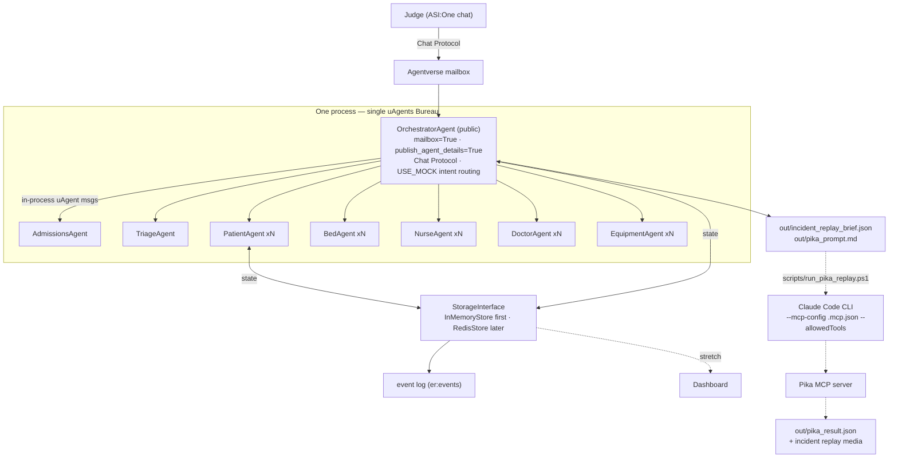

# ER Room Digital Twin

**Hackathon Technical Specification — Developer Reference**

Fetch.ai uAgents + Bureau · ASI:One · in-memory/Redis state · Pika MCP replay (via Claude Code)

> Target: 24-hour build · Python 3.11+ · Local Bureau, one Agentverse mailbox

**One-liner:** *Fetch.ai coordinates the ER response; ASI:One exposes the public chat interface; StorageInterface/Redis records the event trace; Claude Code CLI invokes Pika MCP to turn that trace into replay media.*

> **Connecting as a teammate or judge?** See [`AGENT.md`](AGENT.md) for how to reach the canonical ER Twin Orchestrator on ASI:One / Agentverse — and why you should **not** re-register your own copy.

---

## Feasibility Verdict

**✅ Feasible — with one critical architecture choice**

**Single-process Bureau (verified P1 default).** Everything runs in **one Python process, one `Bureau`**: the public `OrchestratorAgent` (`mailbox=True`, `publish_agent_details=True`, Chat Protocol) is added to the same Bureau as the private ER entity agents, and they communicate via in-process uAgent messaging. ASI:One reaches only the Orchestrator.

> **Verified by spike.** Official Fetch docs do not prominently showcase `mailbox=True` agents inside a Bureau, but our local spike on `uagents==0.25.2` (`spikes/mailbox_inside_bureau_spike.py`) proves that **`Bureau.run_async` starts a member agent's mailbox client** and that **in-process Orchestrator ↔ entity messaging works** in this project environment. If Agentverse/ASI:One smoke testing fails, we fall back to the documented **two-process pattern** (standalone Orchestrator process + separate Bureau process) — see *Architecture Alternatives and Fallbacks*.

**Why one process:** the riskiest seam (does the mailbox client start, and does internal messaging work?) is now proven, in-process, with one event loop and one command to debug. The two-process split would trade that proven seam for an *untested* cross-process endpoint hop — worse for a 24-hour build.

**Conclusion:** all agents are real uAgents inside a single local Bureau; only the `OrchestratorAgent` gets an Agentverse mailbox + Chat Protocol + ASI:One so you can talk to the system from outside.

**Demo priority:** Talking to the ASI:One orchestrator and watching it trigger ER events. Everything else is built in service of that one interaction loop.

---

## Overview

Emergency rooms operate in controlled chaos — every room, patient, nurse, doctor, and piece of equipment is a moving variable. This project builds an autonomous digital twin of a hospital emergency room where every physical entity is modeled as a uAgent, agents coordinate in real time via in-process Bureau messaging, and a single `OrchestratorAgent` — reachable through ASI:One — responds to critical events autonomously.

> This is not a dashboard that shows data. It is a system that **acts**.

---

## Getting Started

**Prerequisites:** Python 3.11+, [`uv`](https://docs.astral.sh/uv/) (`brew install uv`).

```bash
# 1. Clone and enter the repo
git clone https://github.com/RyanDang363/berk-ai-hackathon.git
cd berk-ai-hackathon

# 2. Set up environment variables
cp .env.example .env
# Edit .env — for a no-API-key local run, leave USE_MOCK=true

# 3. Install dependencies (creates a local .venv)
uv sync

# 4. Run the system (mock mode — no ASI:One key needed): ONE process, ONE Bureau
USE_MOCK=true uv run python -m er_twin.main

# 5. Run the tests
uv run pytest
```

**Mock mode:** `USE_MOCK=true` skips the *external* services — deterministic keyword intent lookup
instead of the ASI:One LLM, `InMemoryStore` instead of Redis, `NoopMemory` instead of Iris — but still
runs the **real** agent coordination in-process over deterministically seeded state. So replies are
state-derived (not canned) and reproducible with **no API keys** (see the `USE_MOCK` contract in
[docs/TEAM.md](docs/TEAM.md)). Set `USE_MOCK=false` (+ keys) for the live ASI:One LLM, Redis, and Iris.

**How it works:** [ARCHITECTURE.md](ARCHITECTURE.md) maps the implemented system — subsystems, the
three event flows, and the state / memory / replay layers.

**Who builds what:** see [docs/TEAM.md](docs/TEAM.md) for the ownership map and git workflow, and
[STATUS.md](STATUS.md) for live progress.

---

## Core Problem

Emergency rooms suffer from cascading inefficiencies caused by static, reactive coordination:

- **Reactive triage** — staff only respond after bottlenecks form
- **No real-time resource awareness** — nurses waste time locating equipment
- **Manual bed assignment** — slow and error-prone under surge conditions
- **Critical event delays** — no autonomous escalation when a patient deteriorates
- **Siloed systems** — no single source of truth for room, staff, and equipment state

---

## Architecture

This is the **Fetch.ai-native path**: build directly on uAgents, run everything in **one process /
one `Bureau`**, with the public `OrchestratorAgent` (mailbox) added to the same Bureau as the
private ER entity agents. ASI:One discovers and chats with **only** the Orchestrator — it is the
single external surface. State lives behind a `StorageInterface` (InMemoryStore first, Redis later).
After an event runs, the system exports an incident trace that the **Claude Code CLI → Pika MCP**
turn into replay media — an automated post-processing step, *not* part of the Fetch runtime.

**Data-driven replay (LLD §9.1).** Beyond the narrative brief, every milestone also captures a
full-state ER snapshot (with a real `ts`) into `out/replay/{incident}.json`. A `/replay/{incident}`
page replays it on the **same SVG floor map as the live dashboard** (shared `floor.js`), tweening
tokens between snapshots in real time. The milestone keyframes are rasterized to PNGs
(`scripts/capture_replay_frames.py`, Playwright) and fed to Pika `generate_keyframes_video`
(`scripts/run_pika_keyframes.ps1`) for a time-compressed start→end clip; the returned `video_url` is
written back into the incident file and embedded in a gated `/library` page that lists every incident
this session. So Pika reconstructs **ground-truth state**, not a hallucination — and if Pika is
skipped, `/replay/{incident}` still plays the reconstruction. `er:events` / `REPLAY-LOG-002` are
unchanged (`ts` lives only on the snapshot records).

**Single-process runtime (P1 default):**

- **One entry point — `er_twin/main.py`.** Builds a single `Bureau`, adds the `OrchestratorAgent` (`mailbox=True`, `publish_agent_details=True`, `Protocol(spec=chat_protocol_spec)`) **and** all private entity agents (Admissions, Triage, Patient(s), Bed(s), Nurse(s), Doctor(s), Equipment(s)), then `bureau.run()`.
- **Orchestrator** is the only public surface (Agentverse mailbox + ASI:One). It handles the 3 NL demo triggers, dispatches **in-process** uAgent messages to the private agents, and writes the event log + `out/incident_replay_brief.json`.
- **Entity agents** have **no mailbox** and **no Agentverse profiles** — private by design.

> **Not** the "other framework → uAgent Adapter → Agentverse" path, and **not** hosting every
> entity as a public Agentverse agent. Pika MCP is never called by uAgents directly — only by the
> Claude Code CLI. The **two-process** split (standalone Orchestrator + separate Bureau) is the
> documented fallback if ASI:One smoke testing fails — see *Architecture Alternatives and Fallbacks*.

**Implementation notes (carry into P1 code):**

- **Async, not request/response.** uAgents messaging is fire-and-forget: a chat handler `ctx.send`s and returns; the reply arrives later in a *separate* `@on_message` handler. The Orchestrator must store `{session/request id → user sender address}` and send the final `ChatMessage` from the response handler. (This matters more than the process-count decision.)
- **Construct, don't import, the chat protocol:** `chat = Protocol(spec=chat_protocol_spec)` then `orchestrator.include(chat)`. There is no importable `chat_proto`.
- **Pin Python `>=3.11,<3.13`** — Python 3.14 breaks `uagents==0.25.2` event-loop init. The venv is on 3.12.
- Use `network="testnet"` to quiet Almanac/funding warnings (mailbox reachability doesn't need on-chain funds). Keep `USE_MOCK=true` for P1. Add `openai` to deps only when wiring the real ASI:One call.

### System Diagram



The solid path (chat → Orchestrator → in-process Bureau agents → state → event log → brief) is the
Fetch.ai judging path, all in one process. The dotted path (brief → `run_pika_replay.ps1` → Claude
Code CLI → Pika MCP → `pika_result.json` + media) is the **automated** creative replay layer. The
dashboard — originally a stretch goal — is now implemented (read-only FastAPI over the same store,
plus the data-driven `/replay` and `/library` pages). (Entity agents are private — only the
Orchestrator is on Agentverse.)

### Key Architecture Decisions

| Decision | Rationale |
| --- | --- |
| **Fetch.ai-native (no adapter)** | Build directly on `uagents` — no LangChain/CrewAI/AutoGen/uAgent-Adapter in the main runtime. The judging path is pure Fetch: uAgents + Bureau + Agentverse mailbox + Chat Protocol + ASI:One. |
| **Single-process Bureau (P1 default, spike-proven)** | The public `OrchestratorAgent` (`mailbox=True`) and all private entity agents live in **one `Bureau`, one process**. Our spike on `uagents==0.25.2` proves the Bureau starts the Orchestrator's mailbox client and in-process messaging works. Two-process (standalone Orchestrator + separate Bureau) is the documented fallback if ASI:One smoke testing fails. |
| **Bureau for all agents** | In-process messaging between the Orchestrator and every ER entity agent — no cross-process hop, no Almanac overhead, persistent state across handler calls. The proven seam; essential for demo reliability. |
| **Single Agentverse mailbox** | Only `OrchestratorAgent` registers on Agentverse + Chat Protocol. This is the sole public entry point; ASI:One talks to nothing else. Maps to the HIPAA story: patient data never leaves the local process. |
| **ASI:One LLM reasoning** | `OrchestratorAgent` calls the ASI:One API to interpret natural language commands and decide which internal agents to message; `USE_MOCK=true` swaps in deterministic intent routing for offline demos. |
| **State behind an interface** | One record per agent ID (vitals, status, location, assignments) behind `StorageInterface`. **`InMemoryStore` is the demo-safe default**; `RedisStore` swaps in later with zero handler changes — Redis is never a blocker for the core demo. |
| **Pika MCP via Claude Code CLI (automated)** | The Fetch runtime emits a structured incident trace (`incident_replay_brief.json` + `pika_prompt.md`); **`scripts/run_pika_replay.ps1` → Claude Code CLI (`--mcp-config .mcp.json --allowedTools ...`) → Pika MCP** turns it into replay media → `out/pika_result.json`. Verified end-to-end. uAgents never call Pika directly. Manual VSCode operator flow is the documented fallback (Alternative B). |

---

## Build Priority Order

Strict priority — each level is only started once the previous one demonstrably works.

| Priority | Goal | Deliverable |
| --- | --- | --- |
| **P1 — Mandatory Fetch.ai judging path** | ASI:One chat reaches the public Orchestrator and round-trips | `er_twin/agents/orchestrator.py` (mailbox=True + Chat Protocol + `USE_MOCK` intent routing), `er_twin/main.py` (single Bureau builder), deterministic trigger routing |
| **P2 — Minimal local agent coordination** | In-process messaging proven (the seam the spike validated) | `er_twin/agents/stub.py` added to the same Bureau; Orchestrator sends `PingRequest` → `StubAgent` replies `PingResponse` → Orchestrator relays to chat |
| **P3 — One meaningful ER event** | Real multi-agent coordination, not a mock | Patient intake **or** low-oxygen: Orchestrator dispatches to local agents → agents update the store → useful ASI:One reply |
| **P4 — Incident replay bridge** | Pika-ready output from the event trace | Structured event logging → `out/incident_replay_brief.json` + `out/pika_prompt.md` |
| **P5 — Pika MCP automation** | Automated media from the brief | `scripts/run_pika_identity_check.ps1` + `scripts/run_pika_replay.ps1` → Claude Code CLI (`--mcp-config .mcp.json --allowedTools ...`) → `out/pika_result.json` |
| **P6 — Redis** | Durable state (optional for demo) | `RedisStore` behind the existing interface, **only after** the core demo works. `InMemoryStore` stays the default; Redis must not block P1. |
| **P7 — Stretch** | Cut first if behind | Dashboard · captions/voiceover · additional events · fal.ai fallback · PharmacyAgent |

The judging demo, end to end: **(1)** judge chats with ASI:One → **(2)** ASI:One reaches the
Agentverse Orchestrator → **(3)** Orchestrator triggers a real local Bureau event → **(4)** ER
agents update state + event log → **(5)** Orchestrator replies with what happened → **(6)** system
emits a Pika-ready replay brief → **(7)** `run_pika_replay.ps1` drives the Claude Code CLI → Pika MCP
to generate the incident replay (**pre-generated before judging**; the live run is shown as
proof-of-work).

---

## Technical Stack

| Component | Detail |
| --- | --- |
| **Language** | Python 3.11+ |
| **Agent framework** | `uagents` + `uagents-core` (Bureau for local agents; Chat Protocol for Orchestrator). No adapter / no other framework in the runtime. |
| **Orchestrator brain** | ASI:One LLM via API — reasoning layer + the chat interface demoed to judges. `USE_MOCK=true` → deterministic intent routing, no API call. |
| **State / memory** | `StorageInterface` — **`InMemoryStore` is the default** (zero deps, demo-safe); one record per agent ID; event log on `er:events`. `RedisStore` is a later swap (P4). |
| **Creative replay** | **Pika MCP**, driven by the **Claude Code CLI** (headless, `--mcp-config .mcp.json --allowedTools ...`) via `scripts/run_pika_replay.ps1`. Consumes `out/incident_replay_brief.json` + `out/pika_prompt.md`, writes `out/pika_result.json`. Automated post-processing — not in the Fetch runtime. |
| **Secrets** | `.env` + `.env.example` — keys: `ASIONE_API_KEY`, `REDIS_URL` (optional), `FAL_KEY` (optional). Never commit `.env`. |
| **Optional — fal.ai** | Cuttable fallback for media generation **only if** Pika MCP fails or there is spare time. Not on the critical path; not implemented by default. |
| **Stretch — dashboard** | FastAPI + static HTML reading the store. Cut first if behind schedule. |

---

## Agent Roster

> **Instance counts for demo** — Keep small: 3 PatientAgents, 2 NurseAgents, 2 DoctorAgents, 4 BedAgents, a handful of EquipmentAgents. This is a twin demo, not a load test.

### Core Agents (Build First)

| Agent | Responsibility |
| --- | --- |
| **OrchestratorAgent** | Mailbox + Chat Protocol + ASI:One. Public entry point. Receives NL commands, reasons with ASI:One LLM, dispatches uAgent messages to all Bureau agents. The only agent registered on Agentverse. |
| **TriageAgent** | Scores incoming patients by acuity level. Routes to appropriate bed and care team via Orchestrator. |
| **AdmissionsAgent** | Handles patient intake, collects initial data, passes structured record to TriageAgent. |
| **PatientAgent** | Tracks acuity level, vitals, current status, assigned bed, and care team. Emits state change events on deterioration. |
| **NurseAgent** | Tracks availability, current assignments, location, skill set. Accepts task dispatches from Orchestrator. |
| **DoctorAgent** | Tracks specialty, availability, current patient load. Responds to consult and emergency broadcasts. |
| **BedAgent** | Tracks occupancy, attached equipment, cleanliness status, specialty designation. Responds to assignment and release requests. |
| **EquipmentAgent** | One agent per critical device (oxygen tank, defibrillator, IV pump). Tracks supply level, location, and in-use status. Broadcasts low-supply alerts. |

### Stretch Agent

| Agent | Responsibility |
| --- | --- |
| **PharmacyAgent** | Handles medication requests and fulfillment. Add only after all core event flows are working end-to-end. |

---

## ASI:One Registration

Only one agent in the entire system needs to be registered on ASI:One: the `OrchestratorAgent`. All Bureau agents are internal and private by design.

| Agent | ASI:One Status |
| --- | --- |
| **OrchestratorAgent** | ✅ Registered — Mailbox + Chat Protocol. Public entry point for ASI:One and human operators. |
| **PatientAgent** | ❌ Not registered — internal only. Private patient state never leaves the Bureau. |
| **BedAgent** | ❌ Not registered — internal only. |
| **NurseAgent** | ❌ Not registered — internal only. |
| **DoctorAgent** | ❌ Not registered — internal only. |
| **EquipmentAgent** | ❌ Not registered — internal only. |
| **TriageAgent** | ❌ Not registered — internal only. |
| **AdmissionsAgent** | ❌ Not registered — internal only. |

### Orchestrator Registration Code

**Single process — `er_twin/main.py`** (Orchestrator + private agents in one Bureau, spike-proven):

```python
from uagents import Agent, Bureau, Protocol
from uagents_core.contrib.protocols.chat import chat_protocol_spec

orchestrator = Agent(
    name="er-orchestrator",
    seed=os.getenv("AGENT_SEED"),
    mailbox=True,                 # bridges Agentverse <-> ASI:One
    publish_agent_details=True,   # publish profile for discovery
    network="testnet",            # quiets Almanac/funding warnings
)
chat = Protocol(spec=chat_protocol_spec)  # constructed, NOT imported
# ... register @chat.on_message(ChatMessage) handlers on `chat` ...
orchestrator.include(chat)

# ONE Bureau holds the public Orchestrator AND the private entity agents.
bureau = Bureau()
bureau.add(orchestrator)   # mailbox client is started by Bureau.run_async (spike-verified)
bureau.add(stub_agent)     # P2 first; then admissions, triage, patient pool, beds, nurses, ...
bureau.run()               # one event loop, one process, one command
```

> **Fallback (two-process):** if ASI:One/Agentverse smoke testing fails, split into a standalone
> `orchestrator.run()` process + a separate `Bureau(endpoint=[...])` process that the Orchestrator
> messages by address. See *Architecture Alternatives and Fallbacks*. The mailbox needs a one-time
> **Agent Inspector → Connect → Mailbox** step before ASI:One can reach it (same for both layouts).

---

## Events — Core Demo Scenarios

Implement **exactly 3 events** for the demo. Each must be triggerable via a natural language command to the `OrchestratorAgent` through ASI:One. Hardcode a scripted trigger for each so the demo is deterministic.

| Event | Trigger Phrase | Agent Flow |
| --- | --- | --- |
| **1. Patient Intake** | *"A new patient arrived with chest pain"* | AdmissionsAgent receives patient → TriageAgent scores acuity → OrchestratorAgent assigns bed and care team → BedAgent + NurseAgent update the store → confirmation returned to ASI:One chat. |
| **2. Low Oxygen Alert** | *"Bed 3's patient oxygen is dropping"* | EquipmentAgent (O₂ tank) emits low-supply alert → OrchestratorAgent finds nearest available unit → NurseAgent dispatched → store updated → status confirmation in chat. |
| **3. Status Summary** | *"Show me what's happening in the ER"* | OrchestratorAgent reads live state across all agents → synthesizes summary via ASI:One LLM → returns to chat. |

Each event also appends structured lines to the `er:events` log (P4), which the Orchestrator
exports as `out/incident_replay_brief.json` + `out/pika_prompt.md` — consumed by the automated Pika
MCP replay step (P5, `scripts/run_pika_replay.ps1`).

---

## 24-Hour Build Timeline

| Hours | Priority | Focus |
| --- | --- | --- |
| **0–2h** | done | Repo setup. Message schemas (`protocols.py`), `StorageInterface` + `InMemoryStore`, `config.py`, seed addresses. *(Phase 0 — complete.)* |
| **2–6h** | **P1/P2** | `orchestrator.py` (mailbox + Chat Protocol + `USE_MOCK` routing), `stub.py`, `main.py` (single Bureau with both). Chat ping round-trips in-process. ASI:One reaches the Orchestrator. |
| **6–12h** | **P3** | One full event end-to-end (intake): Admissions → Triage → Bed → Nurse/Doctor, in the Bureau, updating the store, with a useful chat reply. |
| **12–16h** | **P4/P5** | Structured event logging → `out/incident_replay_brief.json` + `out/pika_prompt.md`. Build `run_pika_identity_check.ps1` + `run_pika_replay.ps1`; pre-generate one Pika clip. Second event if ahead. |
| **16–20h** | **P3/P6** | Third event. Then `RedisStore` swap (optional). Harden the `USE_MOCK` deterministic demo path. |
| **20–22h** | — | Polish. Rehearse the 7-step demo. Confirm all events fire cleanly with `USE_MOCK=true`. Pre-generate final replay. Slides. |
| **22–24h** | **P7** | Stretch only: dashboard · captions/voiceover · fal.ai fallback · PharmacyAgent. Final presentation prep. |

---

## Scope Fences

### In Scope

- Fetch.ai-native runtime: `uagents` + Bureau directly (no adapter, no other framework)
- All entity agents run locally/private in the Bureau — **only** the Orchestrator is public
- `OrchestratorAgent` mailbox + Chat Protocol; ASI:One talks to it and nothing else
- `InMemoryStore` as the demo-safe default state layer (Redis is a later, optional swap)
- 3 PatientAgents, 2 NurseAgents, 2 DoctorAgents, 4 BedAgents, a few EquipmentAgents
- Exactly 3 events: intake→triage→bed, low-oxygen response, status summary
- Incident replay bridge: export `incident_replay_brief.json` + `pika_prompt.md` for Pika MCP
- Automated Pika MCP replay via Claude Code CLI (`run_pika_replay.ps1`); pre-generate the final clip
- Simulated synthetic patient data only — no real PHI

### Explicitly Out of Scope

- **Hosting every agent on Agentverse** — only the Orchestrator is public (flaky, slow, not needed)
- **The "other framework → uAgent Adapter → Agentverse" path** — we build Fetch-native
- **ASI:One talking to any agent besides the Orchestrator**
- **Pika MCP inside the Fetch runtime** — it is invoked by the Claude Code CLI, never from `er_twin/`
- **Redis as a prerequisite** — the core demo runs on `InMemoryStore`; Redis is P6/optional
- **fal.ai** — optional/cuttable fallback only (Alternative E); not implemented unless Pika MCP fails
- **Dashboard** — stretch only, cut first if behind schedule
- 3D hospital model, hardware/IoT layer, production HIPAA compliance, PharmacyAgent, 4th+ events

### Down-Ranked Assumptions (explicitly rejected as defaults)

These earlier assumptions are **not** part of the current plan — do not reintroduce them as defaults:

- ❌ Every ER entity registered on Agentverse — only the Orchestrator is public.
- ❌ Every ER entity needs a mailbox — internal agents have none.
- ❌ Orchestrator must run as its own separate process — it lives **inside** the single Bureau (spike-proven); two-process is the fallback only.
- ❌ Redis required before the demo — `InMemoryStore` is the default; Redis is P6/optional.
- ❌ Pika MCP called directly from uAgents — only the Claude Code CLI calls it.
- ❌ Claude SDK / Anthropic API required for Pika — CLI path is verified and primary (SDK is Alt C, future).
- ❌ fal.ai required — fallback only (Alt E).
- ❌ Dashboard required — stretch only.
- ❌ Live video generation during judging required — pre-generate; live run is proof-of-work only.

---

## Architecture Alternatives and Fallbacks

Documented so we can switch paths if setup or bugs force it. Two axes: **runtime** (F–H) and **Pika
replay path** (A–E). **Chosen primaries: Alternative F (single-process Bureau runtime) and
Alternative A (Claude Code CLI → Pika MCP).** Two-process (G) is the runtime fallback.

| Alt | Path | Status | Notes |
| --- | --- | --- | --- |
| **A** | **Fetch runtime + Claude Code CLI + Pika MCP** | ✅ **Primary (verified)** | Fetch writes `incident_replay_brief.json`; `run_pika_replay.ps1` calls the CLI with `--allowedTools`; CLI invokes Pika MCP. Best balance of automation and matching Pika's setup; verified end-to-end. |
| **B** | Manual Claude Code operator (VSCode) | Fallback | Human opens the VSCode session, asks Claude Code to run the Pika workflow from `pika_prompt.md`. Slower, less programmatic — safest live backup if headless tool/permission issues reappear. |
| **C** | Claude SDK / Anthropic API MCP connector | Future / production | Python script calls the Claude API with `mcp_servers=[...]`. Cleaner for a deployed backend; not primary because Pika's hackathon setup targets Claude Code + OAuth. May need token handling. |
| **D** | Custom Python MCP client | Not for 24h build | Fetch/back end speaks MCP to Pika directly. Most direct in theory, highest risk (sessions, auth, tool discovery, async, parsing). Only if everything else is done. |
| **E** | fal.ai direct API | Cuttable fallback | Use fal.ai/Pika model API instead of Pika MCP if MCP breaks or credits fail. Not primary (track wants Pika MCP). Don't add `fal-client` until necessary. |
| **F** | **Single-process Fetch Bureau** | ✅ **Primary runtime (spike-proven)** | One process: public Orchestrator (`mailbox=True`) **inside** the Bureau with the private entity agents. `spikes/mailbox_inside_bureau_spike.py` passes on `uagents==0.25.2` (mailbox client starts; in-process ping round-trips). The chosen P1 default. |
| **G** | Two-process split (standalone Orchestrator + separate Bureau) | Fallback | Orchestrator `agent.run()` (mailbox) + a separate `Bureau(endpoint=[...])` of entity agents, messaged by address. Closer to official examples but adds an *untested* cross-process seam. Use only if the one-process ASI:One smoke test fails. |
| **H** | Multi-process quickstarter style | Last-resort fallback | Orchestrator standalone + each helper agent its own process. Most terminals/process management. Use only if Bureau endpoint messaging is also problematic. |

---

## Risks & Mitigations

| Risk | Mitigation |
| --- | --- |
| **Too many agents → flaky demo** | Use Bureau + small instance counts. Mock any agent not in the demo path. Add a `USE_MOCK=true` env flag that returns hardcoded responses from the Orchestrator. |
| **ASI:One latency / rate limits** | Keep a `USE_MOCK` fallback for the Orchestrator's LLM call (deterministic intent routing). Test rate limits in the first 2 hours. |
| **Redis setup time** | Not a risk for the core demo — `InMemoryStore` is the default. `RedisStore` (P4) swaps in behind the same interface once events work; if Redis misbehaves, the demo still runs. |
| **Pika MCP timing / async** | Replay is automated post-processing, not on the live judging path. **Pre-generate the final replay** from `incident_replay_brief.json` before judging and show the live `run_pika_replay.ps1` run as proof-of-work. Long renders return `{task_id}` → the script polls `task_status`. Manual VSCode operator flow (Alternative B) and fal.ai (Alternative E) are the documented fallbacks. |
| **Headless CLI tool denial** | In `-p` mode the Claude Code CLI auto-denies MCP tool calls unless allowlisted. **Mitigation (verified):** pass an explicit `--allowedTools "mcp__pika-mcp__..."` list; the scripts fail loudly if `permission_denials` is non-empty. Do **not** rely on `--dangerously-skip-permissions`. |
| **Orchestrator ↔ Bureau messaging** | All in-process (single Bureau) — the seam our spike proved. Orchestrator talks to entity agents via deterministic seed-derived addresses set as startup constants; no runtime discovery, no cross-process hop. |
| **Demo reliability** | Hardcode a scripted scenario for each of the 3 events that you can trigger with a single command. Never rely on live randomness during the judging demo. |

---

## Why It Stands Out

- **Real billion-dollar problem** — ER inefficiency costs hospitals and lives
- **Direct Fetch.ai sponsor track showcase** — Bureau, mailbox, Chat Protocol, ASI:One all demonstrated
- **Working agent coordination, not a mock** — judges watch events fire in real time
- **HIPAA-safe by design** — internal agents never leave the local process; Orchestrator is the sole public surface
- **Extensible pitch** — whole-hospital twin, real IoT sensors, EHR integration are credible next steps
- **Narrow enough to ship in 24 hours, impressive enough to win**

---

## Note on HIPAA

This prototype uses entirely synthetic patient data. No real PHI is handled. In a production deployment, Bureau agents would run inside the hospital's own infrastructure — patient data never leaves their network. The architecture (single public Orchestrator surface, all patient state siloed in local Bureau agents) is a stronger compliance posture than centralized hospital software.

---

## Devpost / Submission Deliverables

Checklist of artifacts to attach to the submission:

- [ ] **ASI:One shared chat link** — *(placeholder)*
- [ ] **Agentverse public OrchestratorAgent profile link** — *(placeholder)*
- [ ] **Pika MCP proof:**
  - [ ] [.mcp.json](.mcp.json) (project-scope server registration)
  - [ ] companion skills in `.agents/skills/` + `skills-lock.json`
  - [ ] `out/pika_identity_check.json` (identity + balance, `permission_denials: []`)
  - [ ] generated replay artifact + `out/pika_result.json`
- [ ] **Demo script** with the three exact trigger phrases (see [docs/TEAM.md](docs/TEAM.md))
- [ ] **Note:** all patient data is synthetic — no real PHI.

**Submission one-liner:** *Fetch.ai coordinates the ER response; ASI:One exposes the public chat interface; StorageInterface/Redis records the event trace; Claude Code CLI invokes Pika MCP to turn that trace into replay media.*
